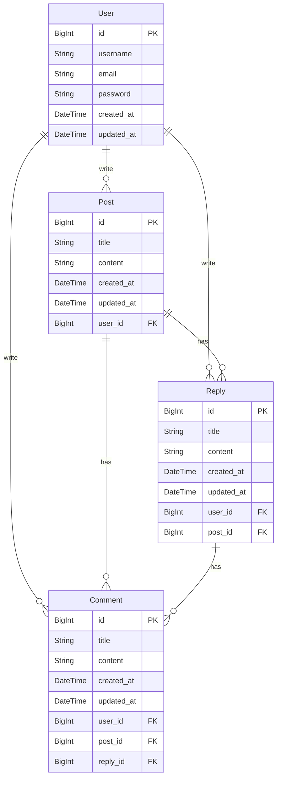
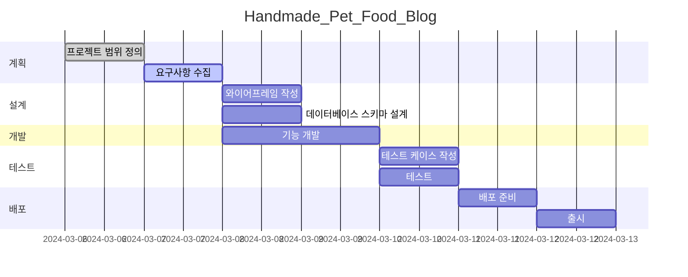

# Handmade_Pet_Food blog

* **목표**
    * 수제 펫푸드 기록 및 소통 블로그
    * 로그인 유저는 자신이 제작 및 급여한 수제 펫푸드 사진들을 업로드할 수 있음
    * 로그인 유저는 타 유저의 게시글에 댓글 및 대댓글을 달면서 서로 정보를 공유할 수 있음

* **사용방법**
    1. 자신의 아이디-비밀번호를 입력하여, 로그인하세요.
    2. 자신이 제작하거나 급여한 수제 펫푸드 사진들 및 후기들을 기록하세요.
    3. 타 유저들과 댓글 및 대댓글 기능을 통해서 활발하게 소통해보세요.

* **서비스 URL 정보**
    * blog github repo: https://github.com/najasinis/Handmade_Pet_Food_Blog
    * notion(for planning): https://www.notion.so/2-0-138c734b18ae494a8fa668773a9f1c8e

* **기존 타 블로그들과의 비교**
    * 필러링된 로그인 유저들만 사용 가능
        * 수제 펫푸드에 관심이 많은 유저들과의 원활한 소통 가능
        * 수제 펫푸드 정보들의 획득 용이성
    * 댓글 및 대댓글
        * 상호 소통이 원활하게 되면서 수제 펫푸드 정보 뿐만 아니라, 펫 양육 지식 또한 획득 가능
     
* **ERD**

 

* **WBS**

* **화면 정의서**
    <table>
        <tr>
            <th>메인화면</th>
            <th>설명</th>
        </tr>
        <tr>
            <td width="70%">

            </td>
            <td>
                <ul>
                    <li>blog URL 변경 필요</li>
                    <li>가장 최신의 게시물을 맨 위에 게시 기능 구현 필요</li>
                    <li>그 외 게시물들을 따로 목록화하는 기능 필요</li>
                    <li>CRUD 검색 기능 구현</li></li>
                </ul>
            </td>
        </tr>
    </table>
    <table>
        <tr>
            <th>포스트 화면</th>
            <th>설명</th>
        </tr>
        <tr width="70%">
            <td width="70%">

            </td>
            <td>
                <ul>
                    <li>게시물 사진이 바로 나오게끔 하기</li>
                    <li>해당 포스트에 대한 댓글 및 대댓글이 나오게끔 하기</li>
                </ul>
            </td>
        </tr>
    </table>
    <table>
        <tr>
            <th>댓글 및 대댓글 화면</th>
            <th>설명</th>
        </tr>
        <tr>
            <td width="70%">

            </td>
            <td>
                <ul>
                    <li>해당 게시글(포스트)에 해당 댓글 및 대댓글이 나타나게끔 하기</li>
                    <li>댓글에 대한 대댓글을 달 수 있게끔 하기</li>
                </ul>
            </td>
        </tr>
    </table>

* **과업**
    * 와이어 프레임에 제시된 3개의 화면 구현 완료(메인 화면, 포스트 화면, 댓글 및 대댓글 화면)
    * user 정보 입력
        * default는 config
        * 다른 분들과 함께 집필할 때에는 호출하게 했음
    * 썸네일 및 영상 업로드 기능 구현
    * CRUD 구현(저장-수정-삭제 기능 구현)
    * 로그인 기능 구현
    * 조회수 기능 구현
    * 작성자 지정 기능 구현
    * 인증 구현

* **향후 액션플랜**
    * 회원가입 기능 구현
    * 와이어프레임을 참고하여 프론트 화면 보완
    * blog URL 변경 필요
    * 가장 최신의 게시물을 맨 위에 게시 기능 구현 필요
    * 그 외 게시물들을 따로 목록화하는 기능 필요
    * 게시물 사진이 바로 나오게끔 하기
    * 해당 포스트에 대한 댓글 및 대댓글이 나오게끔 하기
    * 해당 게시글(포스트)에 해당 댓글 및 대댓글이 나타나게끔 하기
    * 댓글에 대한 대댓글을 달 수 있게끔 하기

* **애러와 애러 해결(트러블슈팅 히스토리)**
    * blog url 실현 X
        * tube에 들어가서 blog class 지정 후, url을 연동했으나 에러 발생
        * 멘토님께도 피드백받았으나, 시간 부족으로 추후 따로 보완할 예정
  
    * 검색기능 구현 시도, 모델 조회 파트에서 오류
        * search 모델 구현 후, 조회 코드 추가 예정

* **API 명세서**

[Swagger](localhost:8000)  

|app: accounts|HTTP Method|설명|로그인 권한 필요|작성자 권한 필요|Admin 권한|
|:-|:-|:-|:-:|:-:|:-:|
|'login/'|POST|유저 로그인|||
|'logout/'|POST|유저 로그아웃|✅||
|'register-admin/'|POST|관리자 계정 생성|||✅|
|'register/'|POST|일반 사용자 계정 생성|||
|'user/'|GET|현재 로그인한 사용자 정보 조회|✅||
|'users/'|GET|전체 사용자 목록 조회|||✅|
|'<int:pk>/'|GET|특정 사용자 정보 조회|||✅|
|'<int:pk>/'|PUT|특정 사용자 정보 수정||✅|✅|
|'<int:pk>/'|PATCH|특정 사용자 정보 부분 수정||✅|✅|
|'<int:pk>/'|DELETE|특정 사용자 삭제|||✅|
|'<int:pk>/delete/'|DELETE|특정 사용자 삭제|||✅|
|'<int:pk>/tokens/generate/'|POST|특정 사용자 토큰 생성|||✅|
 

|app: alarm|HTTP Method|설명|로그인 권한 필요|작성자 권한 필요|Admin 권한|
|:-|:-|:-|:-:|:-:|:-:|
|'alarms/'|GET|전체 알람 목록 조회|✅||
|'alarms/'|POST|새로운 알람 생성|✅||
|'alarms/<int:pk>/'|GET|특정 알람 조회|✅||
|'alarms/<int:pk>/'|PUT|특정 알람 수정|✅|✅|
|'alarms/<int:pk>/'|PATCH|특정 알람 부분 수정|✅|✅|
|'alarms/<int:pk>/'|DELETE|특정 알람 삭제|✅|✅|
|'risks/'|GET|전체 위험 목록 조회|✅||
|'risks/'|POST|새로운 위험 생성|✅||
|'risks/<int:pk>/'|GET|특정 위험 조회|✅||
|'risks/<int:pk>/'|PUT|특정 위험 수정|✅|✅|
|'risks/<int:pk>/'|PATCH|특정 위험 부분 수정|✅|✅|
|'risks/<int:pk>/'|DELETE|특정 위험 삭제|✅|✅|
|'alarm-types/'|GET|전체 알람 유형 목록 조회|✅||
|'alarm-types/'|POST|새로운 알람 유형 생성|✅||✅|
|'alarm-types/<int:pk>/'|GET|특정 알람 유형 조회|✅||
|'alarm-types/<int:pk>/'|PUT|특정 알람 유형 수정|✅||✅|
|'alarm-types/<int:pk>/'|PATCH|특정 알람 유형 부분 수정|✅||✅|
|'alarm-types/<int:pk>/'|DELETE|특정 알람 유형 삭제|✅||✅|
|'receive-alarm-data/'|POST|알람 데이터 수신|||✅|
 

|app: chat|HTTP Method|설명|로그인 권한 필요|작성자 권한 필요|Admin 권한|
|:-|:-|:-|:-:|:-:|:-:|
|'rooms/'|GET|전체 채팅방 목록 조회|✅|||
|'rooms/'|POST|새로운 채팅방 생성|✅|||
|'rooms/<int:pk>/'|GET|특정 채팅방 조회|✅|||
|'rooms/<int:pk>/'|PUT|특정 채팅방 수정|✅|✅||
|'rooms/<int:pk>/'|PATCH|특정 채팅방 부분 수정|✅|✅||
|'rooms/<int:pk>/'|DELETE|특정 채팅방 삭제|✅|✅||
|'rooms/<int:room_pk>/messages/'|GET|특정 채팅방 메시지 목록 조회|✅|||
|'rooms/<int:room_pk>/messages/'|POST|특정 채팅방에 새로운 메시지 생성|✅|||
|'rooms/<int:room_pk>/messages/<int:pk>/'|GET|특정 채팅방의 특정 메시지 조회|✅|||
|'rooms/<int:room_pk>/messages/<int:pk>/'|PUT|특정 채팅방의 특정 메시지 수정|✅|✅||
|'rooms/<int:room_pk>/messages/<int:pk>/'|PATCH|특정 채팅방의 특정 메시지 부분 수정|✅|✅||
|'rooms/<int:room_pk>/messages/<int:pk>/'|DELETE|특정 채팅방의 특정 메시지 삭제|✅|✅||
 

|app: media|HTTP Method|설명|로그인 권한 필요|작성자 권한 필요|Admin 권한|
|:-|:-|:-|:-:|:-:|:-:|
|'files/'|GET|전체 미디어 파일 목록 조회|✅|||
|'files/'|POST|새로운 미디어 파일 업로드|✅|||
|'files/<int:pk>/'|GET|특정 미디어 파일 조회|✅|||
|'files/<int:pk>/'|PUT|특정 미디어 파일 수정|✅|✅||
|'files/<int:pk>/'|PATCH|특정 미디어 파일 부분 수정|✅|✅||
|'files/<int:pk>/'|DELETE|특정 미디어 파일 삭제|✅|✅||
|'files/<int:pk>/predict/'|POST|특정 미디어 파일 예측|✅|||
 

|app: notice|HTTP Method|설명|로그인 권한 필요|작성자 권한 필요|Admin 권한|
|:-|:-|:-|:-:|:-:|:-:|
|''|GET|전체 공지사항 목록 조회||||
|''|POST|새로운 공지사항 생성|||✅|
|'<int:pk>/'|GET|특정 공지사항 조회||||
|'<int:pk>/'|PUT|특정 공지사항 수정|||✅|
|'<int:pk>/'|PATCH|특정 공지사항 부분 수정|||✅|
|'<int:pk>/'|DELETE|특정 공지사항 삭제|||✅|
 

* **활용한 언어 및 툴 정리**
    * Python
    * HTML/CSS/JS
    * Django
    * 노션
    * Git
    * VS code
